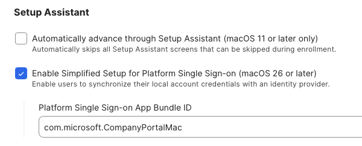
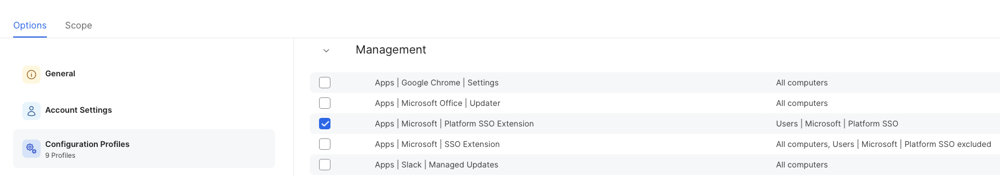
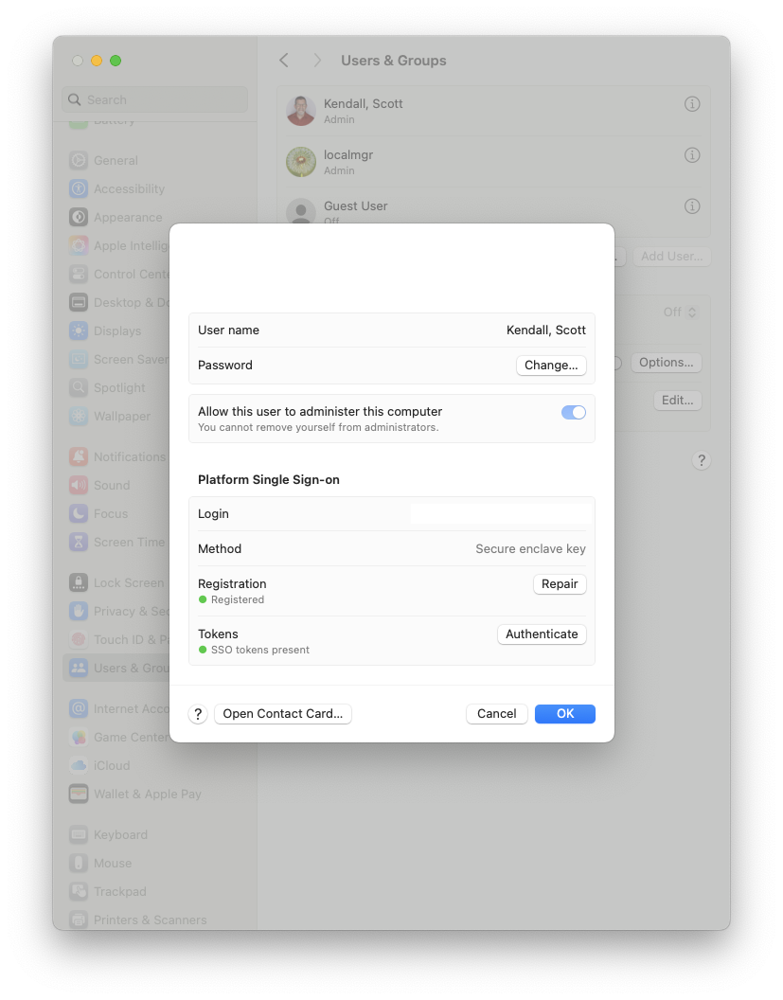
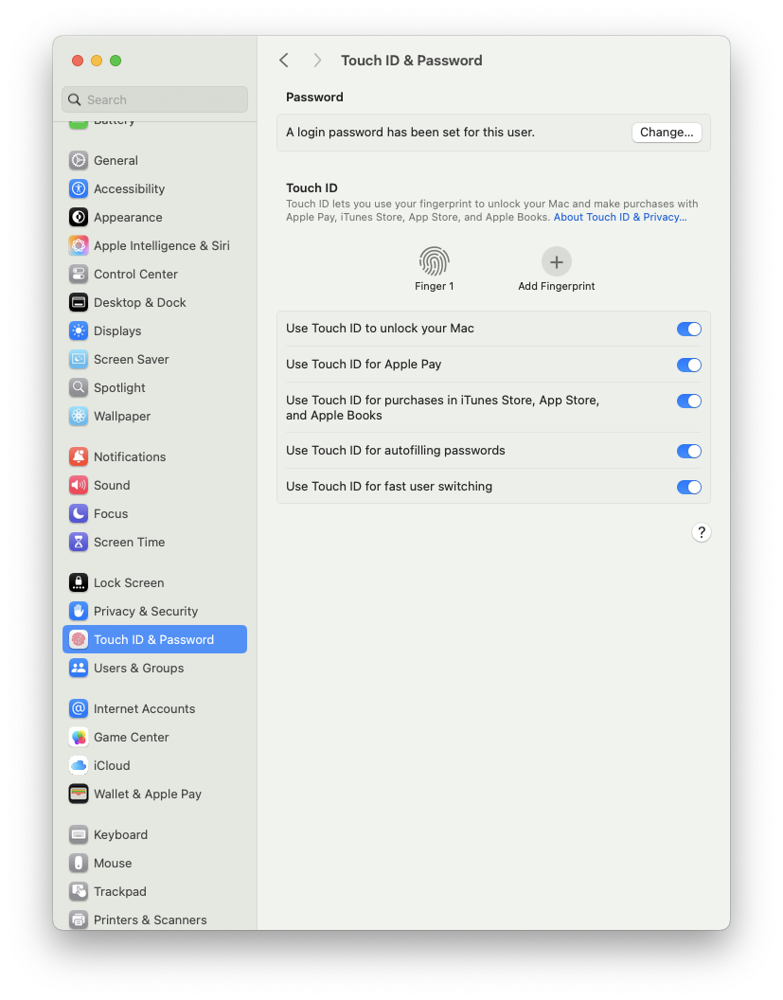

## Plaform SSO Repository ##

This sub-repo section is designed to accomodate everything Micdrosoft Platform SSO related.  My goal is to try and consolidate everything that an admin needs to be aware of when migrating users to Platform SSO for macOS Sequoia and higher.  I am hoping for other contributors in this repo to make this a central repository for everything related to this extension.  I will be posting the information that I have concerning JAMF MDM, but others are welcome to post about configuration files / processes for other MDMs.

<p align="center">
  
</p>

### AI (Gemini) Overview ###

Platform SSO is an OS-level integration that enables single sign-on for apps and websites, often seen with Apple's macOS, while Enterprise SSO is a broader category of services that use an identity provider to grant single sign-on access to multiple applications for an entire organization. Platform SSO builds on Enterprise SSO capabilities to provide a more seamless experience by managing authentication directly at the operating system level, rather than through a browser or separate application. 

__Platform SSO__

* __Level of integration:__ Works at the operating system level to integrate with the user's local account credentials.
* __Key benefit:__ Provides a more streamlined and seamless experience, as authentication can happen transparently in the background for both native and web applications on the device.
* __Example:__ Apple's Platform SSO feature for macOS, which replaces directory binding and synchronizes local account credentials with an identity provider like Microsoft Entra ID. 

__Enterprise SSO__

* __Level of integration:__ A broader concept that provides a centralized authentication service for an entire organization's applications.
* __Key benefit:__ Simplifies password management, improves security, and reduces help desk tickets across a wide range of business applications.
* __Example:__ A user logs into an enterprise SSO portal once and is then granted access to all connected applications, including web-based services and legacy apps that may not support modern identity protocols. 

__How they work together__
* __Platform SSO is an implementation of Enterprise SSO:__ Platform SSO is a specific technology that builds on Enterprise SSO concepts to achieve a deeper level of integration with the operating system.
* __Platform SSO leverages an Enterprise SSO service:__ It uses an Enterprise SSO service (and its associated identity provider) to handle the authentication, but performs the actual single sign-on process directly on the device.
* __Example:__ In a macOS environment, Microsoft's Platform SSO uses the Microsoft Entra ID Enterprise SSO plug-in to handle authentication, but integrates with the macOS system to provide background, OS-level sign-on

### JAMF Configuration ###

In order to prepare for Platform SSO deployment, you must perform the following:

1. [Deploy Microsoft Company Portal](#company-portal)
2. [Create the Platform SSO Configuration Profile](#ceate-psso-configuration-profile)
3. [Configure ADE for Simplified Setup](#configure-ade-for-simplied-setup)
4. [Remove any existing SSO Extension Profile](#removing-the-sso-exension)
5. [Enable access to the System Settings](#enable-access-to-system-settings)
6. [Make sure touchID is enabled](#enable-touchid)
7. [Deliver the PlatformSSO Configuration Profile](#deliver-the-psso-config-profile)
8. [Run Device Compliance from CompanyPorta](#8-device-compliance)

### 1. Company Portal ###

* You need to install v5.2404.0 or newer in your prestage enrollment (for new enrollments) or install via policy (to existing users).  Company Portal can be downloaded [here](https://go.microsoft.com/fwlink/?linkid=853070)

### 2. Create pSSO Configuration Profile ###

When setting up the Configuration Profile, you can use either the Microsoft [docs](https://learn.microsoft.com/en-us/intune/intune-service/configuration/use-enterprise-sso-plug-in-macos-with-intune?tabs=prereq-jamf-pro%2Ccreate-profile-jamf-pro) or JAMF [docs](https://learn.jamf.com/en-US/bundle/technical-articles/page/Platform_SSO_for_Microsoft_Entra_ID.html#ariaid-title9).  I have included screenshots of my setup for easier reference:


Please note: you must configure an Associate Domain payload, but it does NOT need to have anything in it, just configure it... 

### 3. Configure ADE for Simplied Setup ###

You will need to make some changes to your ADE (Automated Device Enrollment) setup to take advantage of pSSO:

1. Navigate to JAMF > Computers > Prestage Enrollment
2. In the General section, you need to "Enable Simplified setup" and add "com.microsoft.CompanyPortalMac" in the field



3. In the Configuration Profiles section, make sure that your Platform SSO group is checked, so it will get pushed down during new enrollments



4. Make sure to add the Company Portal app in the Enrollment Packages section

### 4. Removing the (old) SSO Exension ###

You need to have a configuration profile for the Platform SSO that can be deployed.  *IMPORTANT!*  You CANNOT have both SSO Extension and Platform SSO Extension deployed to all users simultaneously.  

The best way to do this is to create groupings and deploy the pSSO to the users in the group, while simultenously excluding them from the SSO Extension group.  Screenshot for exxample:


### 5. Enable Access to System Settings ###

You will need to make sure thate Sytem Settings -> Users & Groups is available to the users.  Inside of there are options to repair the SSO extension for users



You can use the Repair option to fix any issues found during authentication.

### 6. Enable TouchID ###

You might need to change your existing Configuration Profiles to allow the Touch ID to be accesed/enabled on systems.  If you are not going to use Secure Enclave as the preferred method for pSSO, you can ignore this setting:



### 7. Deliver the pSSO Config Profile ###

Once you have setup your smart/static group for deployment, you can push it to all of the users...once the profile gets installed on their mac, they will see the following in their notification center.


And the user will need to proceed with the registration prompts.

In case the users do not see the notification center prompt (or they dismiss it), it will reappear after a period of time (I think around 15 mins), but you can "force" the prompt to reappear again.  You can either have the user logout/login, or you can use a script I created (found [here](https://github.com/ScottEKendall/JAMF-Pro-Scripts/blob/main/ForcePlatformSSO/README.md) that will force the prompt to reappear and show a nice GUI screen so the users (hopefully) don't miss it again.


## 8. Device Compliance ##

You need to make sure that Device Compliance is run after the user(s) registers with Platform SSO. You can do this one of two ways:

1.  Deliver a policy that executes the command ```/usr/local/jamf/bin/jamfAAD gatherAADInfo```
2.  Have the user run your Register with Entra policy from SS / SS+


_If you do not run this Device Compliance, the user might get the "register your device" when trying to authenticate._

## Extended Attributes (EA) for JAMF

I have an EA script that I use to determine the status of the User(s) registration status and create groups accordingly.... It is multi-user aware. Script can be found [here](https://github.com/ScottEKendall/JAMF-Pro-EAs/blob/main/InTune%20Registration%20Status.sh)


## Reference Documentation ##

I am trying to stick with the company "official" docs as much as possible, but I do have an "other" section, and I will try to have comprehensive guides if possible.

Apple Platform SSO Docs

* pSSO for macOS [here](https://support.apple.com/en-gb/guide/deployment/dep7bbb05313/web)


JAMF Docs
* Platform SSO can be found [here](https://learn.jamf.com/en-US/bundle/technical-articles/page/Platform_SSO_for_Microsoft_Entra_ID.html)
* Configuration Profiles can be found [here](https://learn.jamf.com/en-US/bundle/technical-articles/page/Platform_SSO_for_Microsoft_Entra_ID.html#ariaid-title9)

Microsoft Links:
* Overview of pSSO [here](https://learn.microsoft.com/en-us/entra/identity/devices/macos-psso)
* Company portal can be found [here](https://learn.microsoft.com/en-us/intune/intune-service/apps/apps-company-portal-macos)
* SSO Plugin for Apple Devices [here](https://learn.microsoft.com/en-us/entra/identity-platform/apple-sso-plugin)
* Common pSSO scenerios [here](https://learn.microsoft.com/en-us/intune/intune-service/configuration/platform-sso-scenarios)

Other Links:

* Comprehensive guide on configuring inTune for pSSO / inTune MacAdmins [here:](https://www.intunemacadmins.com/complete-guide-macos-deployment/configure_macos_platform_sso/)
* How to configure pSSO / SimpleMDM [here](https://simplemdm.com/blog/how-to-configure-platform-single-sign-on/)