## Platform SSO with Microsoft Entra ##

This repository is designed to consolidate everything a Jamf Pro admin might need to configure Platform SSO with Microsoft Entra, and to migrate existing Macs.  I am hoping for other contributors to help make this repo a useful source of information for everything related to this framework.  The repo currently focuses on using Platform SSO with the Jamf Pro MDM, but others are welcome to share configuration files, processes, and best practices for other MDMs.

<p align="center">
  
</p>

### AI (Gemini) Overview ###
_of Extensible SSO vs Platform SSO_

Extensible SSO is the underlying framework that allows third-party extensions to enable single sign-on (SSO) on Apple devices, while Platform SSO is an evolution of this technology that provides a more deeply integrated, device-centric SSO experience for macOS. 
Platform SSO offers a more seamless sign-on process for users and deeper integration with Microsoft Entra ID (formerly Azure AD), especially for organizations that have embraced hybrid work and passwordless authentication. 

| Feature            | Extensible SSO (SSOe)                                                                                                                                       | Platform SSO (PSSO)                                                                                                                                                                                                                |
| :----------------- | :---------------------------------------------------------------------------------------------------------------------------------------------------------- | :--------------------------------------------------------------------------------------------------------------------------------------------------------------------------------------------------------------------------------- |
| User experience    | Less integrated; users typically had to sign in to unlock the device and then sign in again to activate the SSO extension.                                  | Highly integrated; users sign in once with their Microsoft Entra ID credentials at the macOS login screen, eliminating the need for a second sign-in for apps.                                                                     |
| Scope              | App-centric. A third-party SSO extension could handle authentication for multiple applications, which was flexible for apps that lacked native SSO support. | Device-centric. It works at the device level and includes the underlying SSO app extension. When you configure Platform SSO, you don't need to configure the app extension separately.                                             |
| Authentication     | Supported a variety of authentication protocols, such as OAuth, OpenID Connect, and SAML2.                                                                  | Supports modern authentication methods, including passwordless authentication with a hardware-bound key (Platform Credential), smart cards, and Entra ID passwords. It also supports Kerberos-based SSO for on-premises resources. |
| Credential syncing | Did not automatically sync the local account password with the cloud identity password.                                                                     | With the password authentication method, the user's Microsoft Entra ID password is synchronized with their local macOS account password.                                                                                           |
| Prerequisites      | Requires a Mobile Device Management (MDM) profile to be deployed for the SSO app extension.                                                                 | Requires the macOS device to be enrolled in an MDM and the latest Microsoft Intune Company Portal app to be installed.                                                                                                             |
| Device enrollment  | Supports user and device enrollment.                                                                                                                        | Supports Entra ID Join for Macs, allowing any organizational user to sign into the device.                                                                                                                                         |
| Availability       | Available on iOS, iPadOS, and macOS.                                                                                                                        | Primary focus is on macOS 14+ for the best experience.                                                                                                                                                                             |


**When to use which**

For most modern deployments, Platform SSO is the recommended choice for macOS devices because of its superior user experience and tighter integration with Microsoft Entra ID. 

* Choose Platform SSO if you:
    * Want to simplify the login process for your Mac users.
    * Are adopting passwordless authentication methods.
    * Want to fully integrate your Macs with Microsoft Entra ID.
    * Manage macOS devices with Microsoft Intune or another compatible MDM.

* Use the legacy Extensible SSO framework if you:
    * Need to support older Apple devices running macOS 13 or earlier.
    * Need the flexibility to use a third-party SSO extension for specific applications.
    * Only require the SSO app extension for authentication without the deeper platform integration.

--- End AI Generated Overview ----

### Jamf Pro Configuration ###

In order to prepare for Platform SSO deployment, you must perform the following:

1. [Deploy Microsoft Company Portal](#1-company-portal)
2. [Create the Platform SSO Configuration Profile](#2-create-psso-configuration-profile)
3. [Configure ADE for Simplified Setup](#3-configure-ade-for-simplified-setup)
4. [Remove any existing SSO Extension Profile](#4-remove-the-old-sso-extension)
5. [Enable access to System Settings](#5-enable-access-to-system-settings)
6. [Make sure Touch ID is enabled](#6-enable-touch-id)
7. [Configure jamfAAD to use WebView](#7--configure-jamfaad-to-use-webview)
8. [Deliver the Platform SSO Configuration Profile](#8-deliver-the-psso-config-profile)
9. [Run Device Compliance](#9-run-device-compliance)

### Misc Stuff (Notes / Scripts / EAs)

* [Check the logs for issues](#checking-the-logs)
* [Users running Focus Mode](#focus-mode)
* [Important note about Secure Enclave](#important-note-when-use-secure-enclave)
* [Extension Attributes](#extension-attributes-ea-for-jamf)
* [Scripts](#scripts-used-for-platform-sso)
* [Changes from Extensible SSO](#changes-from-extensible-sso)

### 1. Company Portal ###

* You need to install v5.2410.1 or newer in your prestage enrollment (for new enrollments) or install via policy (to existing users).  Here's a direct download for the Company Portal installer: https://go.microsoft.com/fwlink/?linkid=853070

### 2. Create pSSO Configuration Profile ###

When setting up the Configuration Profile, you can use either the Microsoft [docs](https://learn.microsoft.com/en-us/intune/intune-service/configuration/use-enterprise-sso-plug-in-macos-with-intune?tabs=prereq-jamf-pro%2Ccreate-profile-jamf-pro) or Jamf Pro [docs](https://learn.jamf.com/en-US/bundle/technical-articles/page/Platform_SSO_for_Microsoft_Entra_ID.html#ariaid-title9).  I have included screenshots of my setup for easier reference:

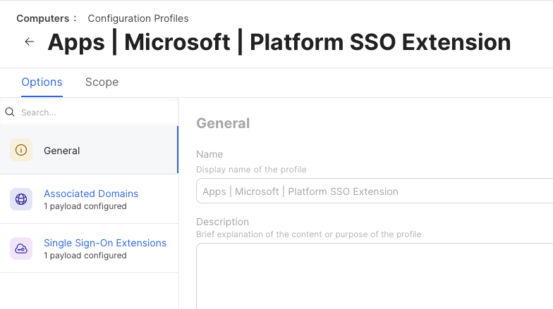
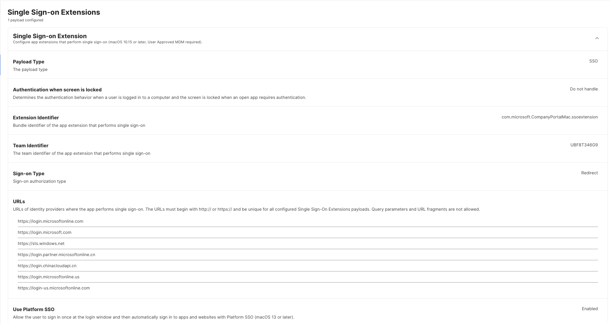

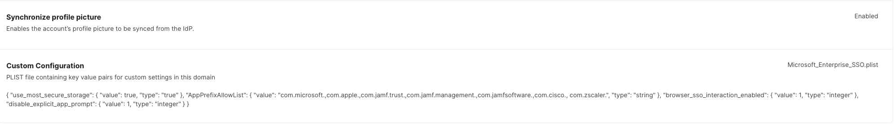

Please note: you must configure an Associate Domain payload, but it does NOT need to have any contents.

### 3. Configure ADE for Simplified Setup ###

You will need to make some changes to your ADE (Automated Device Enrollment) setup to take advantage of pSSO:

1. In the Jamf Pro console, navigate to Computers > PreStage Enrollment
2. In the General section, you need to "Enable Simplified setup" and add "com.microsoft.CompanyPortalMac" in the field

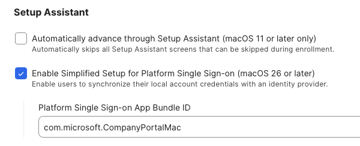

3. In the Configuration Profiles section, make sure that your Platform SSO profile is checked so it will get pushed down during new enrollments

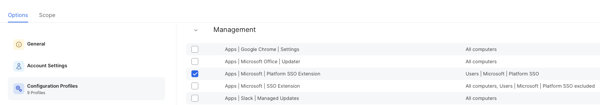

4. Make sure to add the Company Portal app in the Enrollment Packages section

### 4. Remove the old SSO Extension ###

You need to have a configuration profile for the Platform SSO that can be deployed.  *IMPORTANT!*  You CANNOT have both SSO Extension and Platform SSO Extension deployed to all users simultaneously.

The best way to do this is to create groupings and deploy the pSSO to the users in the group, while simultenously excluding them from the SSO Extension group.  Screenshot for exxample:

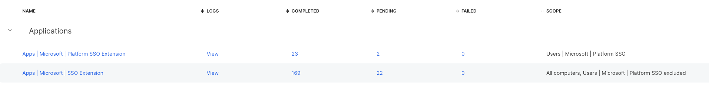

### 5. Enable Access to System Settings ###

You will need to make sure that Sytem Settings -> Users & Groups is available to the users.  Inside of there are options to repair the SSO extension for users

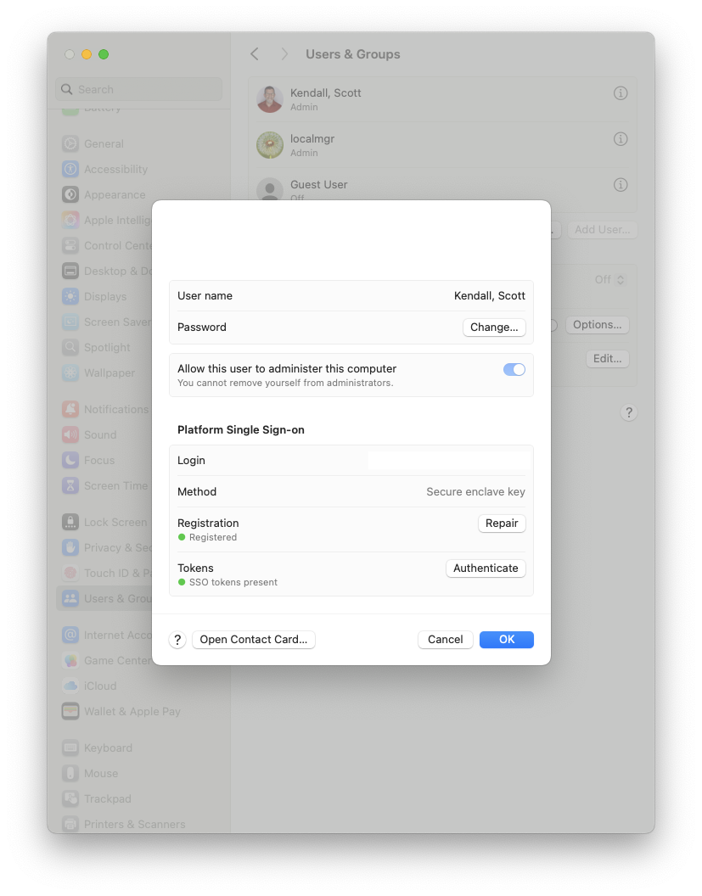

You can use the Repair option to fix any issues found during authentication.

### 6. Enable Touch ID ###

On systems that have TouchID, you might need to change your existing Configuration Profiles to allow the Touch ID to be accessed and enabled on systems.  If you are not going to use Secure Enclave as the preferred method for pSSO, you can ignore this setting:

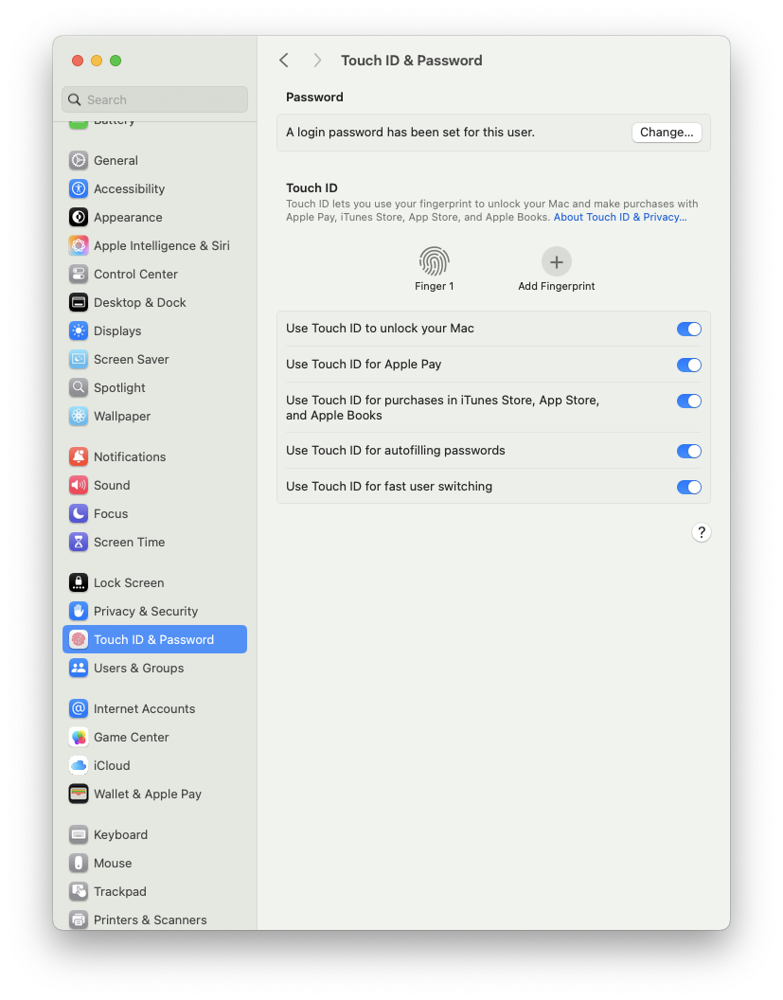

I have a working EA that will determine the status of TouchID on the systems.  

https://github.com/ScottEKendall/JAMF-Pro-EAs/blob/main/TouchID%20Status.sh

>IMPORTANT!  You might need to have two pSSO config profiles, one that will support TouchID and one for systems without TouchID

>You will need to change the `Authentication Method` in the Platform SSO to use "Password" instead of "Use Secure Enclave Key"

>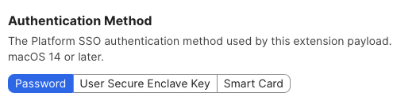

### 7.  Configure jamfAAD to use WebView ###

To avoid issues with browser redirection during the login process, you can configure the JamfAAD app to use WebView instead.  The following policy will perform the following:

* Force jamfAAD to use WebView
* Eanble jamfAAD logging
* Settings to recheck for a valid Entra ID
* Fixes pre-fill authentication failure on first attempt

Create a new Configuration Profile:

Application & Custom Settings > Upload

    Preference Domain: com.jamf.management.jamfAAD

  ```xml
  <?xml version="1.0" encoding="UTF-8"?>
  <!DOCTYPE plist PUBLIC "-//Apple//DTD PLIST 1.0//EN" "http://www.apple.com/DTDs/PropertyList-1.0.dtd">
  <plist version="1.0">
  <dict>
    <key>useWKWebView</key>
    <true/>
    <key>logPII</key>
    <string>true</string>
    <key>OIDCUsePassThroughAuth</key>
    <true/>
    <key>OIDCNewPassword</key>
    <false/>
    <key>tokenRetryCount</key>
    <integer>3</integer>
    <key>tokenRetryWaitTime</key>
    <integer>42</integer>
    <key>disableUPNLoginHint</key>
    <true/>
  </dict>
  </plist>
  ```
The JAMF docs for this can be found here:

[Creating a Policy Directing Users to Register Mac Computers with Microsoft Entra ID](https://learn.jamf.com/en-US/bundle/technical-paper-microsoft-intune-current/page/Creating_a_Policy_Directing_Users_to_Register_Mac_Computers_with_Azure_Active_Directory.html)

### 8. Deliver the pSSO Config Profile ###

After you have setup your Smart/Static Group for deployment, you can push it to all of the users. Once the profile gets installed on their Mac, they will see the following in their Notification Center.


And the user will need to proceed with the registration prompts.

In case the users do not see the notification center prompt (or they dismiss it), it will reappear after a period of time (I think around 15 mins), but you can "force" the prompt to reappear again.  These are a few ways that you can accomplish this:

1. You can have the user log out and log back in.
2. You can run this "faceless" script:
  ```
  runAsUser() 
  { 
    launchctl asuser $currentUID sudo -u $currentUser "$@" 
  }

  pssoCheckStatus() 
  { 
    runAsUser app-sso platform -s | awk -F'.*" : "?|"|,' '/"state"/ {print $2}' 
  }

  if [[ -z $(pssoCheckStatus) ]]; then
	  echo "Plugin not initialized, reloading AppSSOAgent"
	  pkill AppSSOAgent
	  sleep 1
	  runAsUser app-sso -l
  fi
  ```
3. [You can show the user this GUI script I created](https://github.com/ScottEKendall/JAMF-Pro-Scripts/blob/main/ForcePlatformSSO/) that will force the prompt to reappear so the users (hopefully) don't miss it again.  This script is focus mode aware and will display an appropriate message.  You can optionally check for TouchID registration and it will also auto-enable the Password & Autofill option for Company Portal,


4.  Another alternative script that you can use is called P.S.E.U.D.O. developed by Macjutsu:  This script will also enforce the TouchID (if available) as well as enforce the Platform registration as well.

> P.S.E.U.D.O. (or just pseudo) is an open source script that provides administrators with a solution to enforce Platform SSO registration and/or Touch ID enablement. Deployed using a single script and a required PPPC configuration profile, pseudo leverages swiftDialog and the macOS System Event, System Event UI, and Accessibility frameworks to ensure that users are registering with Platform SSO and/or enabling Touch ID.

https://github.com/Macjutsu/pseudo

1.  Another neat little trick that you can do is to automatically populate the Autofill selection for Company Portal In the General > AutoFill & Password section of System Settings.  This takes advantage of Apple's PluginKit architecture:

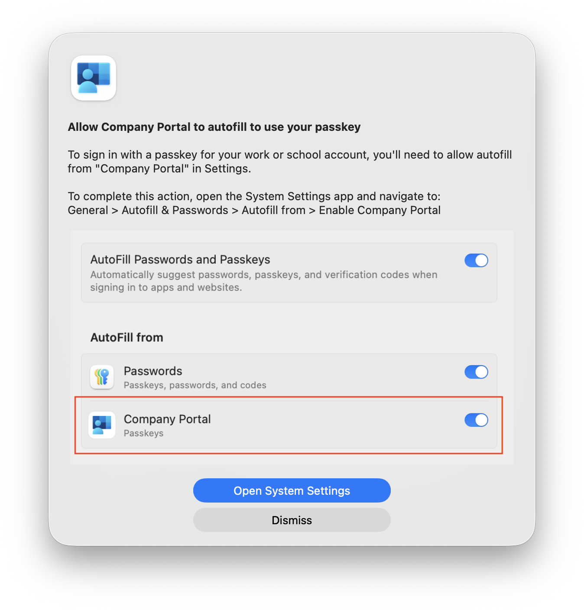
https://github.com/ScottEKendall/Microsoft-Platform-SSO/blob/main/scripts/Enforce%20Portal%20AutoFill.sh

## 9. Run Device Compliance ##

In most cases, the Device Compliance _should_ run after successful Registration, but sometimes it does fail.  If you want to avoid any failures, you need to make sure that Device Compliance is run after the user(s) registers with Platform SSO. You can do this one of two ways:

1.  Deliver a policy that executes the command `/usr/local/jamf/bin/jamfAAD gatherAADInfo`
2.  Have the user run your Register with Entra policy from SS / SS+


_If you do not run this Device Compliance, the user might get the "register your device" when trying to authenticate._

## Focus Mode ##

If users keep themselves in focus mode, they will never receive the pSSO Registration screen.  There are a couple of ways to handle this:

* Here is an EA tha can be used so that you can setup Smart Groups and possibility take action based on the members of the group (targeted email / display prompts / etc). 


```
#!/bin/zsh --no-rcs
LOGGED_IN_USER=$( scutil <<< "show State:/Users/ConsoleUser" | awk '/Name :/ && ! /loginwindow/ { print $3 }' )
FOCUS_FILE="/Users/${LOGGED_IN_USER}/Library/DoNotDisturb/DB/Assertions.json"
results="Off"
if [[ -e $FOCUS_FILE ]]; then
    retval=$(plutil -extract data.0.storeAssertionRecords.0.assertionDetails.assertionDetailsModeIdentifier raw -o - $FOCUS_FILE | grep -ic 'com.apple.')
    [[ $retval == "1" ]] && results="On" || results="Off"
else
    results="Off"
fi
echo "<result>$results</result>"
```

  For a GUI version that is focus aware, you can use this script [found here](https://github.com/ScottEKendall/JAMF-Pro-Scripts/blob/main/ForcePlatformSSO/)
  
## Important note when using Secure Enclave ##

If you are using the Secure Enclave feature for pSSO, please observe this following note:

> _There is no option for password fallback while authenticating with User Secure Enclave Key when
> UserSecureEnclaveKeyBiometricPolicy is enabled. Therefore, users won't be able to authenticate to
> Microsoft Entra ID if they don't have Touch ID biometrics available._

This is taken from this [MS document page](https://learn.microsoft.com/en-us/entra/identity/devices/macos-psso#microsoft-platform-sso-usersecureenclavekeybiometricpolicy)

If your users don't have touch ID on their machines, you should not be using Secure Enclave as the authentication method.  If you have a mixed environment, you have two choices:

1.  Enable password authentication for all users, thus not needing Touch ID.
2.  Seperate your users into Touch ID (Enabled) and no Touch ID and roll out different pSSO policies based on Touch ID hardware.

  Here is an example EA that can be used to test for touch ID

  ```xml
  #!/bin/zsh
  # Determine if Touch ID hardware is present
  result=$(bioutil -r | grep "Biometrics for unlock" | awk -F ":" '{print $2}' | xargs )
  [[ $result == 1 ]] && retval="Present" || retval="No Hardware"
  echo "<result>$retval</result>"
  ```

## Checking the logs ##

If you run into trouble with implementation of pSSO, one of the first things to check is the system logs.  You can do that with the 'predicate' command which can be used to filter the logs:

```/usr/bin/log stream --info --predicate 'process=="mdmclient" AND composedMessage CONTAINS "Processing server request: DeclarativeManagement for" AND composedMessage```

Here is a utility that is MDM Agnostic and will constantly monitor the logs for issues:

https://github.com/microsoft/shell-intune-samples/tree/master/macOS/Tools/mdmCheckinMonitor

## Extension Attributes (EA) for Jamf Pro

I have an EA script that I use to determine user registration status and create groups accordingly. The script is multi-user aware and can be found here: https://github.com/ScottEKendall/JAMF-Pro-EAs/blob/main/InTune%20Registration%20Status.sh


## Scripts used for Platform SSO ##

See the [scripts](scripts/) folder for full script contents.

### Verify Device Compliance via Extensible SSO and Platform SSO.sh

This script can be used to determine Device Compliance for both the extensible SSO (SSOe) and Platform SSO. (pSSO).  If the system is registered with Platform SSO, it still needs to acquire the AAD token.

You can test for both (Apple) Platform SSO and (JAMF) Device Compliance in one of two ways:

1.  if `appleSSO=$(app-sso platform -s | grep "registrationCompleted" | awk -F ":" '{print $2}' | xargs | tr -d ",")` returns `true` then it is apple SSO compliant
2.  if `jamfSSO=$("/Library/Application Support/JAMF/Jamf.app/Contents/MacOS/Jamf Conditional Access.app/Contents/MacOS/Jamf Conditional Access" getPSSOStatus | head -n 1)` returns `2` then it is Device Compliant

NOTE: Suposedly the `/usr/local/jamf/bin/jamfAAD getPSSOStatus` command _should_ return the sames results as step 2 above, but it doesn't, so it might be best to use the Step 2 command for a results test.

Why Check both?

* Because pSSO and Device Compliance are not the same thing. 
* pSSO is between macOS and Entra ID (Proving your identity).
* Device compliance is between Jamf, Intune, and Entra ID (complying with Conditional Access requirements).


## Changes from Extensible SSO ##

When moving away from the (old) extensible SSO method, the "workplace join key" that was present in the Keychain will no longer be there as the functionality of the (new) pSSO has been moved into the Secure Enclave on the mac.  So users will (should) **not** see this image any longer:

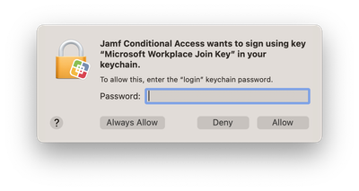

If you have any Smart/Static Groups or EAs that look for the WPJ Key in the users keychain, you need to change your logic to use the `app-sso platform -s` terminal command to determine SSO status.

## Reference Documentation and Resources

I am trying to stick with the company "official" docs as much as possible, but I do have an "other" section, and I will try to have comprehensive guides if possible.

### Apple Platform SSO

* [Platform Single Sign-on for macOS](https://support.apple.com/en-gb/guide/deployment/dep7bbb05313/web)

### Jamf Pro Documentation
* [Deploying macOS Platform SSO for Microsoft Entra ID with Jamf Pro](https://learn.jamf.com/en-US/bundle/technical-articles/page/Platform_SSO_for_Microsoft_Entra_ID.html)
* [Deploying a Platform Single Sign-on Configuration Profile](https://learn.jamf.com/en-US/bundle/technical-articles/page/Platform_SSO_for_Microsoft_Entra_ID.html#ariaid-title9)

### Microsoft Documentation

* [macOS Platform Single Sign-on overview](https://learn.microsoft.com/en-us/entra/identity/devices/macos-psso)
* [Add the macOS Company Portal App](https://learn.microsoft.com/en-us/intune/intune-service/apps/apps-company-portal-macos)
* [Microsoft Enterprise SSO plug-in for Apple devices](https://learn.microsoft.com/en-us/entra/identity-platform/apple-sso-plugin)
* [Common Platform SSO scenarios for macOS devices](https://learn.microsoft.com/en-us/intune/intune-service/configuration/platform-sso-scenarios)
* [Troubleshooting the Microsoft Enterprise SSO Extension plugin on Apple devices](https://learn.microsoft.com/en-us/entra/identity/devices/troubleshoot-mac-sso-extension-plugin)
* [End-to-end guide to get started with macOS endpoints](https://learn.microsoft.com/en-gb/intune/solutions/end-to-end-guides/macos-endpoints-get-started?tabs=psso)

### FileWave Documentation

* [Microsoft Enterprise Platform Single Sign-on for macOS](https://kb.filewave.com/books/macos/page/microsoft-enterprise-platform-single-sign-on-for-macos)

### Okta Setup ###

* [Platform SSO for MacOS](https://trusted.jamf.com/docs/platform-sso-for-macos)
* [Okta & Jamf Pro PSSO Simplified Setup for macOS 26 Setup Guide](https://trusted.jamf.com/docs/technical-documentation-template)

### Simple MDM ###

* [SimpleMDM - How to configure Platform Single Sign-on](https://simplemdm.com/blog/how-to-configure-platform-single-sign-on/)
  
### Workspace One

* [Bryan D Garmon / How to configure pSSO & Workspace One](https://www.aftersixcomputers.com/how-to-configure-apple-platform-sso-using-omnissa-workspace-one-uem/)

### Other Resources

* [IntuneMacAdmins - Configure MacOS Platform SSO](https://www.intunemacadmins.com/complete-guide-macos-deployment/configure_macos_platform_sso/)

* [Aaron David Polley - How To Hold macOS User Identity in 2025](https://aarondavidpolley.com/how-to-hold-macos-user-identity-in-2025/)
* [benwhitis\/Jamf_Conditional_Access - MacOS Conditional Access Best Practices](https://github.com/benwhitis/Jamf_Conditional_Access/wiki/MacOS-Conditional-Access-Best-Practices)


If you find my work useful, please consider a donation to the caffeine fund!

<a href="https://www.buymeacoffee.com/scottekendall" target="_blank"></a>